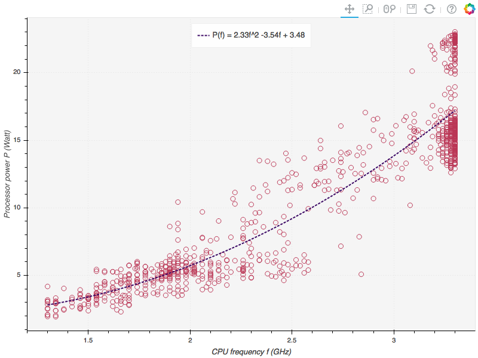

## 1. Introduction

This notebook illustrates the relationship between power consumption, CPU load,  
and CPU frequency of a laptop computer. The subsequent analysis is based on a   
dataset collected from a 13-inch Macbook Pro running on a Core i5-5287U processor  
with MacOS Seirra installed.

The dataset consists of two data frames populated with the following readings:

| Column                        | Desciption |
| ----------------------------  | ---- | 
|Time                           |   Sample time stamp|
|Voltage    |  Voltage reading of the battery (in mV)|
|Current      |  Current reading of the battry (in mA)|
|Remaining charge |   Remaining charge of the battery in (mAh)|
|CPU load |   CPU load in (%)|
|Total power consumption |  Power consumption (in Watts)   computed using $P = V*I$  where V and I are obtained from the Voltage and Current columns|
|Processor power consumption$^*$ |  Power consumption of the processor, i.e.,   *Total power - processor power = pwr cons. of other components* |
|Processor speed (freq)$^*$ |  processor clock frequency (in MHz) at sampling instance|

$^*$ Data collected using [Intel Power Gadget](https://software.intel.com/en-us/articles/intel-power-gadget-20).

----
**Tools used:**

*MacOS SystemProfiler*: to collect battery discharge info., i.e., 
                          voltage and current readings. 
*Intel Power Gadget*: CPU frequency and power consumption monitoring tool

**Python Libraries** 
*psutil*: to gather CPU load at user-defined sampling intervals 
*pandas and numpy*: to process the resulting data 
*bokeh*: for plotting

Aditionally, I had to write a small python program to automate the data collection.  
Finally, for anyone interested, the data and associated code lives [here](https://github.com/mEyob/CPU_load_VS_Power).

## 2. The CPU and power proportional computing

