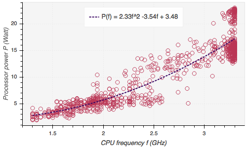
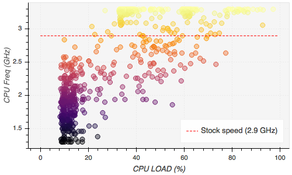
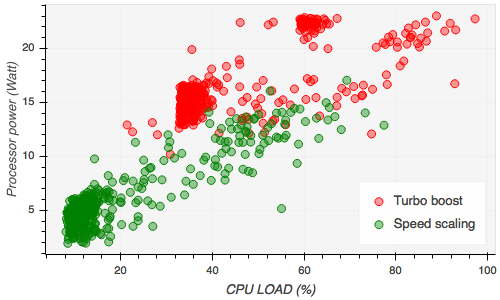
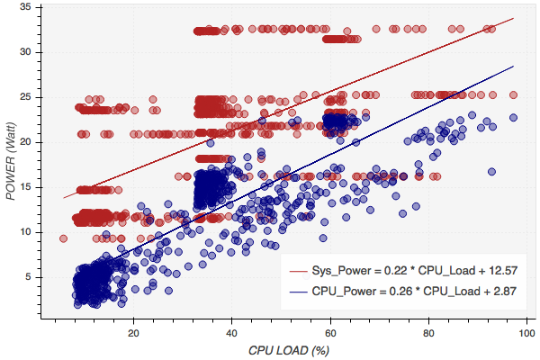

## 1. Introduction

This notebook illustrates the relationship between power consumption, CPU load,  
and CPU frequency of a laptop computer. The subsequent analysis is based on a   
dataset collected from a 13-inch Macbook Pro running on a Core i5-5287U processor  
with MacOS Seirra installed.

The dataset consists of two data frames populated with the following readings:

| Column                        | Desciption |
| ----------------------------  | ---- | 
|Time                           |   Sample time stamp|
|Voltage    |  Voltage reading of the battery (in mV)|
|Current      |  Current reading of the battry (in mA)|
|Remaining charge |   Remaining charge of the battery in (mAh)|
|CPU load |   CPU load in (%)|
|Total power consumption |  Power consumption (in Watts)   computed using *P = V\*I*  where V and I are obtained from the Voltage and Current columns|
|Processor power consumption\* |  Power consumption of the processor, i.e.,   *Total power - processor power = pwr cons. of other components* |
|Processor speed (freq)\* |  processor clock frequency (in MHz) at sampling instance|

\* Data collected using [Intel Power Gadget](https://software.intel.com/en-us/articles/intel-power-gadget-20).

----
**Tools used:**

*MacOS SystemProfiler*: to collect battery discharge info., i.e., 
                          voltage and current readings. 
*Intel Power Gadget*: CPU frequency and power consumption monitoring tool

**Python Libraries** 
*psutil*: to gather CPU load at user-defined sampling intervals 
*pandas and numpy*: to process the resulting data 
*bokeh*: for plotting

Aditionally, I had to write a small python program to automate the data collection.  
Finally, for anyone interested, the data and associated code lives [here](https://github.com/mEyob/CPU_load_VS_Power).

## 2. Energy efficiency

Energy efficiency is a vital factor to consider in the design of modern computer systems.
Some of the top energy consumers in a laptop are CPU, LCD, RAM, GPU, and disk, with the most 
power hungry component being the CPU.

### CPU power consumption

Power consumption of a CPU is usually modeled by the proportionality,

where *V* is the supply voltage to the CPU and *f* is the clock frequency in Hz.
However, clock frequency is also proportional to supply voltage, i.e,

,

yeilding a cubic relatioinship between power consumption (*P*) and clock frequency (*f*). However,
lower degrees of proportionality may often emerge as there are several factors affecting the proportionality.
Generally, 

where the proportionality exponent *a* is in the range (1, 3). 

Let us illustrate this proportionality using the empirical data described in the [Introduction](#1-introduction).
The following figure shows a scatter plot of CPU power consumption as a function of CPU clock frequency. 
The dotted line is a polynomial curve fitting of the data resulting in a quadratic relationship between 
power and frequency (i.e. *a=2* in the above proportionality equation),

## Speed scaling
As shown in the above figure, the CPU operates at a range of frequencies, 1.3 GHz to 3.3 GHz, instead of operating at the advertised stock frequency, which is at 2.9 GHz for the particular [CPU model](http://ark.intel.com/products/84988/Intel-Core-i5-5287U-Processor-3M-Cache-up-to-3_30-GHz)
under consideration. This is for the laptop's own good. When high speed is not needed, the CPU saves battery power by operating at lower 
frequency.

Being the heart of a computer, the CPU also imitates how the heart operates, sort of. Just like our heart starts pumping more blood when we start running or when we engage with some other demanding task, the CPU can vary the clock frequency depending on the amount of workload. This mechanism is called **speed scaling** or **speed step** when the range of frequency is between the *lowest* and the *stock frequency*, and **turbo boost** for frequencies in between the *stock frequency* and the *max frequency*. The following figure illustrates this phenomenon using the data collected from the computer under study.

Some claim that *turbo boost* is just *speed scaling* rebranded for marketing purpose. That might very well be the case. However, one clear distinction
is that with speed scaling, all the cores of a CPU can simultaneously operate at the advertised stock frequency if needed, whereas only one 
core can be turbo boosted at a time.

## Total power vs CPU power

